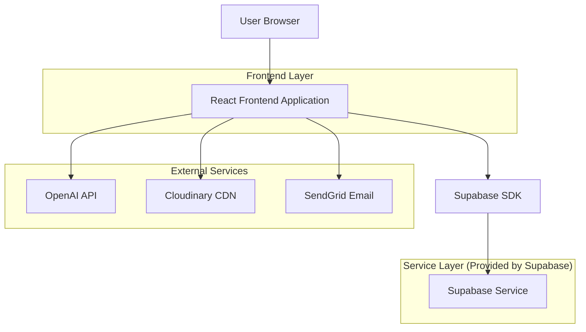
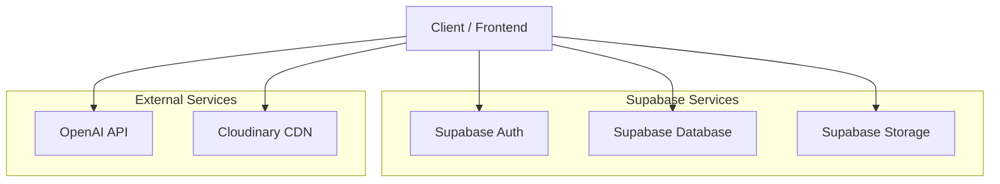
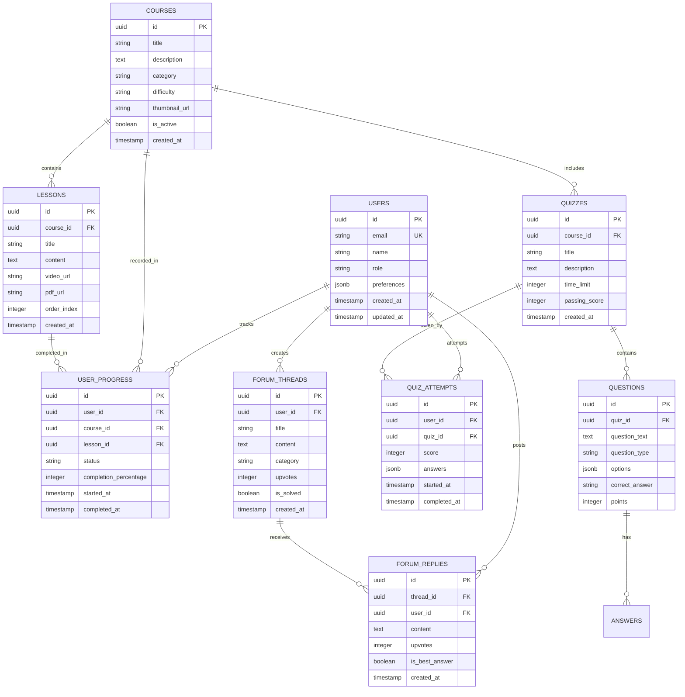

## 1. Architecture Design



## 2. Technology Description

- **Frontend**: React@18 + TypeScript + Tailwind CSS@3 + Vite
- **Backend**: Supabase (Authentication, Database, Storage)
- **External APIs**: OpenAI (AI Assistant), Cloudinary (Image/Video CDN), SendGrid (Email Notifications)
- **State Management**: React Context + useReducer
- **UI Components**: Headless UI + Custom Components
- **Charts**: Recharts untuk progress tracking
- **Real-time**: Supabase Realtime subscriptions

## 3. Route Definitions

| Route | Purpose |
|-------|---------|
| / | Landing page dengan hero section dan overview |
| /login | Halaman login untuk siswa dan guru |
| /register | Halaman registrasi baru |
| /dashboard | Dashboard personal siswa dengan progress tracking |
| /courses | Daftar mata pelajaran dan materi pembelajaran |
| /courses/[id] | Detail materi pembelajaran dengan video dan PDF |
| /practice | Halaman latihan soal dan simulasi ujian |
| /practice/[id] | Detail kuis atau simulasi ujian |
| /forum | Forum diskusi utama |
| /forum/[id] | Detail thread diskusi |
| /profile | Halaman profil pengguna dan pengaturan |
| /achievements | Halaman pencapaian dan sertifikat |
| /admin | Dashboard admin untuk monitoring |

## 4. API Definitions

### 4.1 Authentication API
```
POST /auth/v1/signup
POST /auth/v1/signin
POST /auth/v1/signout
GET /auth/v1/user
```

### 4.2 Courses API
```
GET /rest/v1/courses
GET /rest/v1/courses?id=eq.{id}
POST /rest/v1/courses
PUT /rest/v1/courses?id=eq.{id}
DELETE /rest/v1/courses?id=eq.{id}
```

### 4.3 Progress API
```
GET /rest/v1/user_progress?user_id=eq.{userId}
POST /rest/v1/user_progress
PUT /rest/v1/user_progress?id=eq.{id}
```

### 4.4 Forum API
```
GET /rest/v1/forum_threads
POST /rest/v1/forum_threads
GET /rest/v1/forum_replies?thread_id=eq.{threadId}
POST /rest/v1/forum_replies
```

## 5. Server Architecture Diagram



## 6. Data Model

### 6.1 Data Model Definition



### 6.2 Data Definition Language

```sql
-- Users table
CREATE TABLE users (
    id UUID PRIMARY KEY DEFAULT gen_random_uuid(),
    email VARCHAR(255) UNIQUE NOT NULL,
    name VARCHAR(100) NOT NULL,
    role VARCHAR(20) DEFAULT 'student' CHECK (role IN ('student', 'teacher', 'admin')),
    preferences JSONB DEFAULT '{}',
    created_at TIMESTAMP WITH TIME ZONE DEFAULT NOW(),
    updated_at TIMESTAMP WITH TIME ZONE DEFAULT NOW()
);

-- Courses table
CREATE TABLE courses (
    id UUID PRIMARY KEY DEFAULT gen_random_uuid(),
    title VARCHAR(200) NOT NULL,
    description TEXT,
    category VARCHAR(50) NOT NULL,
    difficulty VARCHAR(20) DEFAULT 'medium' CHECK (difficulty IN ('easy', 'medium', 'hard')),
    thumbnail_url VARCHAR(500),
    is_active BOOLEAN DEFAULT true,
    created_at TIMESTAMP WITH TIME ZONE DEFAULT NOW()
);

-- Lessons table
CREATE TABLE lessons (
    id UUID PRIMARY KEY DEFAULT gen_random_uuid(),
    course_id UUID REFERENCES courses(id) ON DELETE CASCADE,
    title VARCHAR(200) NOT NULL,
    content TEXT,
    video_url VARCHAR(500),
    pdf_url VARCHAR(500),
    order_index INTEGER NOT NULL,
    created_at TIMESTAMP WITH TIME ZONE DEFAULT NOW()
);

-- User progress table
CREATE TABLE user_progress (
    id UUID PRIMARY KEY DEFAULT gen_random_uuid(),
    user_id UUID REFERENCES users(id) ON DELETE CASCADE,
    course_id UUID REFERENCES courses(id) ON DELETE CASCADE,
    lesson_id UUID REFERENCES lessons(id) ON DELETE CASCADE,
    status VARCHAR(20) DEFAULT 'not_started' CHECK (status IN ('not_started', 'in_progress', 'completed')),
    completion_percentage INTEGER DEFAULT 0 CHECK (completion_percentage >= 0 AND completion_percentage <= 100),
    started_at TIMESTAMP WITH TIME ZONE,
    completed_at TIMESTAMP WITH TIME ZONE,
    UNIQUE(user_id, lesson_id)
);

-- Quizzes table
CREATE TABLE quizzes (
    id UUID PRIMARY KEY DEFAULT gen_random_uuid(),
    course_id UUID REFERENCES courses(id) ON DELETE CASCADE,
    title VARCHAR(200) NOT NULL,
    description TEXT,
    time_limit INTEGER, -- in minutes
    passing_score INTEGER DEFAULT 70,
    created_at TIMESTAMP WITH TIME ZONE DEFAULT NOW()
);

-- Questions table
CREATE TABLE questions (
    id UUID PRIMARY KEY DEFAULT gen_random_uuid(),
    quiz_id UUID REFERENCES quizzes(id) ON DELETE CASCADE,
    question_text TEXT NOT NULL,
    question_type VARCHAR(20) DEFAULT 'multiple_choice' CHECK (question_type IN ('multiple_choice', 'true_false', 'essay')),
    options JSONB, -- for multiple choice questions
    correct_answer TEXT NOT NULL,
    points INTEGER DEFAULT 1
);

-- Quiz attempts table
CREATE TABLE quiz_attempts (
    id UUID PRIMARY KEY DEFAULT gen_random_uuid(),
    user_id UUID REFERENCES users(id) ON DELETE CASCADE,
    quiz_id UUID REFERENCES quizzes(id) ON DELETE CASCADE,
    score INTEGER,
    answers JSONB,
    started_at TIMESTAMP WITH TIME ZONE DEFAULT NOW(),
    completed_at TIMESTAMP WITH TIME ZONE
);

-- Forum threads table
CREATE TABLE forum_threads (
    id UUID PRIMARY KEY DEFAULT gen_random_uuid(),
    user_id UUID REFERENCES users(id) ON DELETE CASCADE,
    title VARCHAR(200) NOT NULL,
    content TEXT NOT NULL,
    category VARCHAR(50),
    upvotes INTEGER DEFAULT 0,
    is_solved BOOLEAN DEFAULT false,
    created_at TIMESTAMP WITH TIME ZONE DEFAULT NOW()
);

-- Forum replies table
CREATE TABLE forum_replies (
    id UUID PRIMARY KEY DEFAULT gen_random_uuid(),
    thread_id UUID REFERENCES forum_threads(id) ON DELETE CASCADE,
    user_id UUID REFERENCES users(id) ON DELETE CASCADE,
    content TEXT NOT NULL,
    upvotes INTEGER DEFAULT 0,
    is_best_answer BOOLEAN DEFAULT false,
    created_at TIMESTAMP WITH TIME ZONE DEFAULT NOW()
);

-- Indexes for performance
CREATE INDEX idx_users_email ON users(email);
CREATE INDEX idx_courses_category ON courses(category);
CREATE INDEX idx_lessons_course_id ON lessons(course_id);
CREATE INDEX idx_user_progress_user_id ON user_progress(user_id);
CREATE INDEX idx_user_progress_course_id ON user_progress(course_id);
CREATE INDEX idx_quiz_attempts_user_id ON quiz_attempts(user_id);
CREATE INDEX idx_forum_threads_category ON forum_threads(category);
CREATE INDEX idx_forum_replies_thread_id ON forum_replies(thread_id);

-- Row Level Security (RLS) policies
ALTER TABLE users ENABLE ROW LEVEL SECURITY;
ALTER TABLE user_progress ENABLE ROW LEVEL SECURITY;
ALTER TABLE quiz_attempts ENABLE ROW LEVEL SECURITY;
ALTER TABLE forum_threads ENABLE ROW LEVEL SECURITY;
ALTER TABLE forum_replies ENABLE ROW LEVEL SECURITY;

-- Users can only see their own data
CREATE POLICY "Users can view own profile" ON users FOR SELECT USING (auth.uid() = id);
CREATE POLICY "Users can update own profile" ON users FOR UPDATE USING (auth.uid() = id);

-- Progress policies
CREATE POLICY "Users can view own progress" ON user_progress FOR SELECT USING (auth.uid() = user_id);
CREATE POLICY "Users can insert own progress" ON user_progress FOR INSERT WITH CHECK (auth.uid() = user_id);
CREATE POLICY "Users can update own progress" ON user_progress FOR UPDATE USING (auth.uid() = user_id);

-- Quiz attempts policies
CREATE POLICY "Users can view own attempts" ON quiz_attempts FOR SELECT USING (auth.uid() = user_id);
CREATE POLICY "Users can insert own attempts" ON quiz_attempts FOR INSERT WITH CHECK (auth.uid() = user_id);

-- Forum policies (public read, authenticated write)
CREATE POLICY "Anyone can view forum threads" ON forum_threads FOR SELECT USING (true);
CREATE POLICY "Authenticated users can create threads" ON forum_threads FOR INSERT WITH CHECK (auth.role() = 'authenticated');
CREATE POLICY "Users can update own threads" ON forum_threads FOR UPDATE USING (auth.uid() = user_id);

CREATE POLICY "Anyone can view forum replies" ON forum_replies FOR SELECT USING (true);
CREATE POLICY "Authenticated users can create replies" ON forum_replies FOR INSERT WITH CHECK (auth.role() = 'authenticated');
CREATE POLICY "Users can update own replies" ON forum_replies FOR UPDATE USING (auth.uid() = user_id);

-- Public access for courses and lessons
CREATE POLICY "Anyone can view courses" ON courses FOR SELECT USING (is_active = true);
CREATE POLICY "Anyone can view lessons" ON lessons FOR SELECT USING (true);

-- Grant permissions
GRANT SELECT ON courses TO anon;
GRANT SELECT ON lessons TO anon;
GRANT SELECT ON quizzes TO anon;
GRANT SELECT ON questions TO anon;
GRANT ALL PRIVILEGES ON users TO authenticated;
GRANT ALL PRIVILEGES ON user_progress TO authenticated;
GRANT ALL PRIVILEGES ON quiz_attempts TO authenticated;
GRANT ALL PRIVILEGES ON forum_threads TO authenticated;
GRANT ALL PRIVILEGES ON forum_replies TO authenticated;
```

## 7. Component Structure

### 7.1 Core Components
- `Layout/` - Navigation, Footer, Sidebar
- `Auth/` - Login, Register, Password Reset
- `Dashboard/` - Progress cards, Charts, Recommendations
- `Courses/` - Course cards, Video player, PDF viewer
- `Quiz/` - Quiz interface, Timer, Results
- `Forum/` - Thread list, Reply form, Voting
- `Profile/` - User settings, Achievements

### 7.2 Custom Hooks
- `useAuth()` - Authentication state management
- `useProgress()` - Learning progress tracking
- `useRealtime()` - Real-time updates
- `useLocalStorage()` - Local data persistence

### 7.3 Utility Functions
- `formatTime()` - Time formatting for timers
- `calculateScore()` - Quiz scoring logic
- `uploadFile()` - File upload to Cloudinary
- `sendNotification()` - Email/push notifications