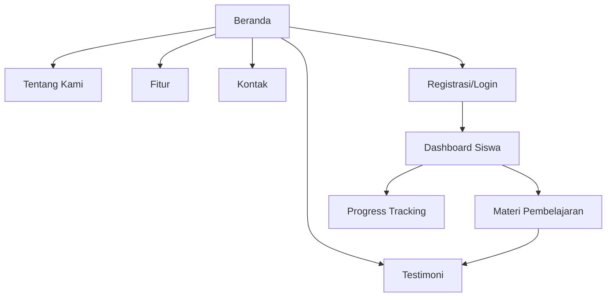

## 1. Product Overview
Kognisia adalah platform pembelajaran digital yang menyediakan informasi dan branding untuk siswa kelas 12. Platform ini menawarkan pengalaman belajar yang modern dan interaktif dengan fokus pada persiapan ujian dan pengembangan akademik.

## 2. Core Features

### 2.1 User Roles
| Role | Registration Method | Core Permissions |
|------|---------------------|------------------|
| Pengunjung | Tidak perlu registrasi | Dapat melihat konten publik, navigasi halaman |
| Siswa | Email/Google registration | Akses ke dashboard pembelajaran, progress tracking |

### 2.2 Feature Module
Website Kognisia terdiri dari halaman-halaman utama berikut:
1. **Beranda**: Hero section, navigasi, fitur unggulan, statistik platform
2. **Tentang Kami**: Visi misi, tim pengembang, sejarah platform
3. **Fitur**: Detail fitur pembelajaran, metode pengajaran, teknologi
4. **Testimoni**: Pengalaman pengguna, kesuksesan siswa, ulasan
5. **Kontak**: Form kontak, informasi layanan, lokasi kantor

### 2.3 Page Details
| Page Name | Module Name | Feature description |
|-----------|-------------|---------------------|
| Beranda | Hero Section | Tampilkan headline menarik, subheadline deskriptif, tombol CTA utama (Mulai Belajar), animasi background yang smooth |
| Beranda | Fitur Unggulan | Tampilkan 4-6 fitur utama dengan ikon, judul, dan deskripsi singkat, animasi hover effect |
| Beranda | Statistik Platform | Tampilkan jumlah siswa, tingkat keberhasilan, jam pembelajaran dengan animasi counter |
| Beranda | Testimoni Preview | Tampilkan 2-3 testimoni teratas dengan foto, nama, dan kutipan singkat |
| Tentang Kami | Visi Misi | Tampilkan visi dan misi perusahaan dengan desain yang menarik |
| Tentang Kami | Tim Pengembang | Tampilkan foto dan biodata singkat tim dengan animasi card flip |
| Fitur | Detail Fitur | Tampilkan penjelasan lengkap setiap fitur dengan gambar ilustrasi |
| Fitur | Metode Pembelajaran | Jelaskan metode pembelajaran yang digunakan dengan infografis |
| Testimoni | Daftar Testimoni | Tampilkan grid testimoni dengan filter berdasarkan kategori |
| Testimoni | Form Testimoni | Form untuk siswa mengirimkan testimoni baru |
| Kontak | Form Kontak | Formulir kontak dengan validasi input |
| Kontak | Informasi Layanan | Tampilkan jam operasional, email, telepon, alamat |

## 3. Core Process

### Pengunjung Flow
1. Pengunjung mengakses halaman beranda
2. Melihat informasi platform melalui hero section dan fitur unggulan
3. Menjelajahi halaman lain (tentang, fitur, testimoni)
4. Menghubungi melalui halaman kontak atau mendaftar sebagai siswa

### Siswa Flow
1. Siswa mendaftar melalui form registrasi
2. Login ke dashboard pribadi
3. Mengakses materi pembelajaran dan tracking progress
4. Memberikan testimoni setelah menggunakan platform

## 4. User Interface Design

### 4.1 Design Style
- **Primary Colors**: Biru (#2563EB) untuk kepercayaan, Hijau (#10B981) untuk pertumbuhan
- **Secondary Colors**: Abu-abu (#6B7280) untuk teks, Putih (#FFFFFF) untuk background
- **Button Style**: Rounded corners (8px), gradient effect, hover animation
- **Font**: Inter untuk heading (16-32px), Poppins untuk body text (14-18px)
- **Layout**: Card-based design dengan spacing yang konsisten
- **Icons**: Linear icons style dengan warna konsisten

### 4.2 Page Design Overview
| Page Name | Module Name | UI Elements |
|-----------|-------------|-------------|
| Beranda | Hero Section | Background gradient biru-hijau, typography besar dan bold, tombol CTA dengan shadow effect, animasi floating elements |
| Beranda | Fitur Unggulan | Grid layout 2x2, card dengan hover lift effect, ikon custom dengan animasi pulse |
| Beranda | Statistik | Counter animation dari 0 ke target, circular progress indicators, warna gradient untuk setiap statistik |
| Testimoni | Daftar Testimoni | Masonry grid layout, card dengan border radius, foto profil dengan circular crop, rating bintang |

### 4.3 Responsiveness
- **Desktop-first design** dengan breakpoint untuk tablet (768px) dan mobile (480px)
- **Touch interaction optimization** untuk mobile devices
- **Adaptive layout** yang menjaga proporsi visual di semua ukuran layar
- **Mobile navigation** dengan hamburger menu dan swipe gestures