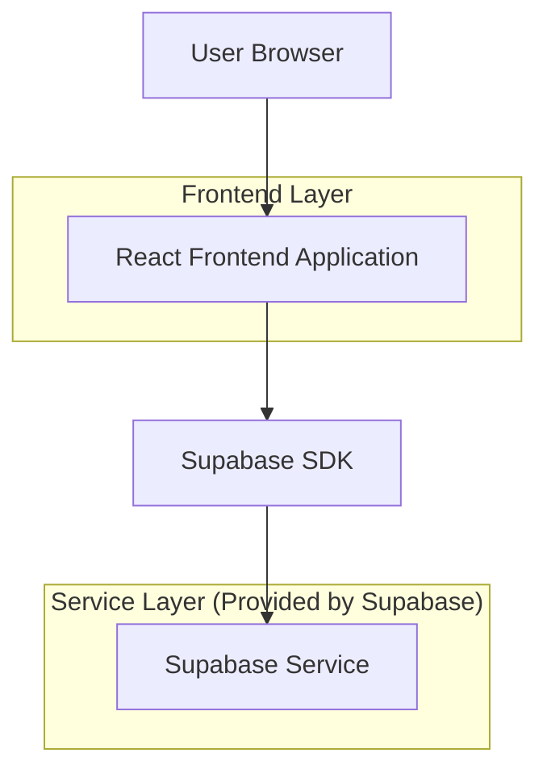
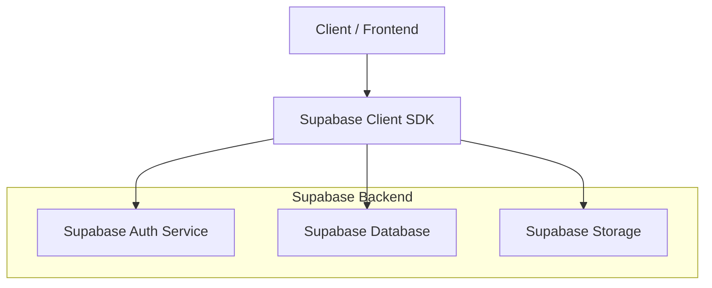
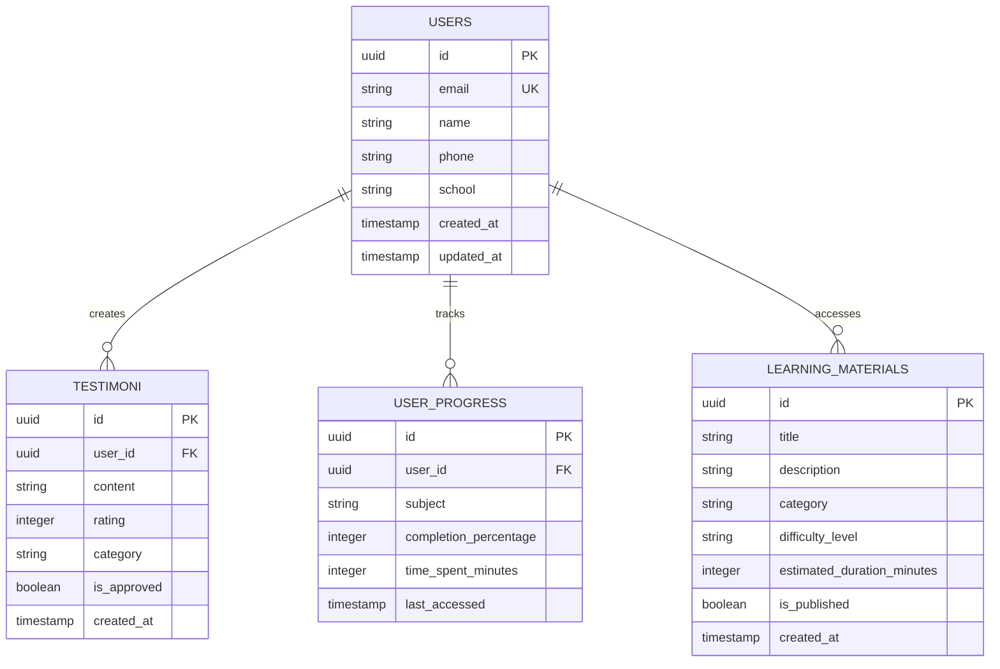

## 1.Architecture design



## 2.Technology Description

* Frontend: React\@18 + Tailwind CSS\@3 + Vite + Framer Motion

* Backend: Supabase (Authentication + Database + Storage)

* Deployment: Vercel (Frontend) + Supabase (Backend)

## 3.Route definitions

| Route      | Purpose                                                |
| ---------- | ------------------------------------------------------ |
| /          | Halaman beranda dengan hero section dan fitur unggulan |
| /tentang   | Halaman tentang kami dengan visi misi dan tim          |
| /fitur     | Halaman detail fitur pembelajaran                      |
| /testimoni | Halaman koleksi testimoni siswa                        |
| /kontak    | Halaman kontak dan informasi layanan                   |
| /dashboard | Dashboard pribadi siswa (memerlukan autentikasi)       |
| /login     | Halaman login siswa                                    |
| /register  | Halaman registrasi siswa baru                          |

## 4.API definitions

### 4.1 Authentication API

```
POST /auth/v1/signup
POST /auth/v1/token?grant_type=password
POST /auth/v1/logout
GET /auth/v1/user
```

### 4.2 Testimoni API

```
GET /rest/v1/testimoni
POST /rest/v1/testimoni
PUT /rest/v1/testimoni/:id
DELETE /rest/v1/testimoni/:id
```

### 4.3 User Progress API

```
GET /rest/v1/user_progress
POST /rest/v1/user_progress
PUT /rest/v1/user_progress/:id
```

## 5.Server architecture diagram



## 6.Data model

### 6.1 Data model definition



### 6.2 Data Definition Language

Users Table

```sql
CREATE TABLE users (
    id UUID PRIMARY KEY DEFAULT gen_random_uuid(),
    email VARCHAR(255) UNIQUE NOT NULL,
    name VARCHAR(100) NOT NULL,
    phone VARCHAR(20),
    school VARCHAR(100),
    created_at TIMESTAMP WITH TIME ZONE DEFAULT NOW(),
    updated_at TIMESTAMP WITH TIME ZONE DEFAULT NOW()
);

CREATE INDEX idx_users_email ON users(email);
```

Testimoni Table

```sql
CREATE TABLE testimoni (
    id UUID PRIMARY KEY DEFAULT gen_random_uuid(),
    user_id UUID REFERENCES users(id) ON DELETE CASCADE,
    content TEXT NOT NULL,
    rating INTEGER CHECK (rating >= 1 AND rating <= 5),
    category VARCHAR(50) DEFAULT 'general',
    is_approved BOOLEAN DEFAULT false,
    created_at TIMESTAMP WITH TIME ZONE DEFAULT NOW()
);

CREATE INDEX idx_testimoni_user_id ON testimoni(user_id);
CREATE INDEX idx_testimoni_approved ON testimoni(is_approved);
CREATE INDEX idx_testimoni_rating ON testimoni(rating DESC);
```

User Progress Table

```sql
CREATE TABLE user_progress (
    id UUID PRIMARY KEY DEFAULT gen_random_uuid(),
    user_id UUID REFERENCES users(id) ON DELETE CASCADE,
    subject VARCHAR(100) NOT NULL,
    completion_percentage INTEGER DEFAULT 0 CHECK (completion_percentage >= 0 AND completion_percentage <= 100),
    time_spent_minutes INTEGER DEFAULT 0,
    last_accessed TIMESTAMP WITH TIME ZONE DEFAULT NOW()
);

CREATE INDEX idx_user_progress_user_id ON user_progress(user_id);
CREATE INDEX idx_user_progress_subject ON user_progress(subject);
```

Learning Materials Table

```sql
CREATE TABLE learning_materials (
    id UUID PRIMARY KEY DEFAULT gen_random_uuid(),
    title VARCHAR(200) NOT NULL,
    description TEXT,
    category VARCHAR(50),
    difficulty_level VARCHAR(20) CHECK (difficulty_level IN ('beginner', 'intermediate', 'advanced')),
    estimated_duration_minutes INTEGER,
    is_published BOOLEAN DEFAULT false,
    created_at TIMESTAMP WITH TIME ZONE DEFAULT NOW()
);

CREATE INDEX idx_learning_materials_category ON learning_materials(category);
CREATE INDEX idx_learning_materials_published ON learning_materials(is_published);
```

### 6.3 Row Level Security (RLS)

```sql
-- Enable RLS on all tables
ALTER TABLE users ENABLE ROW LEVEL SECURITY;
ALTER TABLE testimoni ENABLE ROW LEVEL SECURITY;
ALTER TABLE user_progress ENABLE ROW LEVEL SECURITY;
ALTER TABLE learning_materials ENABLE ROW LEVEL SECURITY;

-- Users can only access their own data
CREATE POLICY "Users can view own profile" ON users FOR SELECT USING (auth.uid() = id);
CREATE POLICY "Users can update own profile" ON users FOR UPDATE USING (auth.uid() = id);

-- Testimoni policies
CREATE POLICY "Anyone can view approved testimoni" ON testimoni FOR SELECT USING (is_approved = true);
CREATE POLICY "Users can insert own testimoni" ON testimoni FOR INSERT WITH CHECK (auth.uid() = user_id);
CREATE POLICY "Users can update own testimoni" ON testimoni FOR UPDATE USING (auth.uid() = user_id);

-- User progress policies
CREATE POLICY "Users can view own progress" ON user_progress FOR SELECT USING (auth.uid() = user_id);
CREATE POLICY "Users can insert own progress" ON user_progress FOR INSERT WITH CHECK (auth.uid() = user_id);
CREATE POLICY "Users can update own progress" ON user_progress FOR UPDATE USING (auth.uid() = user_id);

-- Learning materials policies
CREATE POLICY "Anyone can view published materials" ON learning_materials FOR SELECT USING (is_published = true);
```

### 6.4 Initial Data

```sql
-- Insert sample learning materials
INSERT INTO learning_materials (title, description, category, difficulty_level, estimated_duration_minutes, is_published) VALUES
('Matematika Dasar', 'Pembelajaran konsep matematika fundamental untuk persiapan UTBK', 'matematika', 'beginner', 120, true),
('Fisika Intensif', 'Materi fisika lengkap dengan contoh soal dan pembahasan', 'fisika', 'intermediate', 90, true),
('Kimia Terapan', 'Pembelajaran kimia dengan pendekatan praktis', 'kimia', 'intermediate', 80, true),
('Biologi Komprehensif', 'Materi biologi dari dasar hingga lanjutan', 'biologi', 'advanced', 150, true);

-- Insert sample testimoni
INSERT INTO testimoni (user_id, content, rating, category, is_approved) VALUES
('550e8400-e29b-41d4-a716-446655440001', 'Platform Kognisia sangat membantu saya dalam persiapan UTBK. Materinya lengkap dan mudah dipahami.', 5, 'general', true),
('550e8400-e29b-41d4-a716-446655440002', 'Saya berhasil masuk PTN impian berkat bimbingan dari Kognisia. Terima kasih!', 5, 'success', true),
('550e8400-e29b-41d4-a716-446655440003', 'Fitur tracking progress sangat membantu saya untuk melihat perkembangan belajar.', 4, 'feature', true);
```

