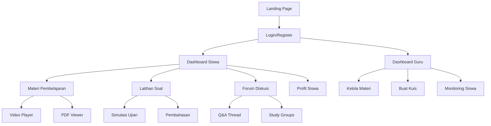

## 1. Product Overview
Kognisia adalah platform pembelajaran digital khusus untuk siswa kelas 12 yang menyediakan materi belajar interaktif, latihan soal, dan persiapan ujian. Platform ini dirancang untuk membantu siswa mempersiapkan diri menghadapi ujian nasional dan ujian masuk perguruan tinggi dengan cara yang lebih efektif dan menyenangkan.

## 2. Core Features

### 2.1 User Roles
| Role | Registration Method | Core Permissions |
|------|---------------------|------------------|
| Siswa | Email/Google registration | Akses materi, latihan soal, tracking progress |
| Guru | Invitation code upgrade | Upload materi, buat kuis, monitoring siswa |
| Admin | System admin | Kelola pengguna, konten, analytics |

### 2.2 Feature Module
Platform Kognisia terdiri dari halaman-halaman utama berikut:
1. **Beranda**: Hero section, navigasi, statistik pembelajaran, materi terpopuler
2. **Dashboard**: Progress tracking, jadwal belajar, rekomendasi materi
3. **Materi Pembelajaran**: Kategori mata pelajaran, video pembelajaran, modul PDF
4. **Latihan Soal**: Bank soal, simulasi ujian, pembahasan jawaban
5. **Forum Diskusi**: Q&A, kolaborasi siswa, bantuan guru
6. **Profil**: Pengaturan akun, sertifikat, riwayat pembelajaran

### 2.3 Page Details
| Page Name | Module Name | Feature description |
|-----------|-------------|---------------------|
| Beranda | Hero section | Tampilkan headline motivasi, CTA utama, animasi background edukatif |
| Beranda | Statistik pembelajaran | Tampilkan jumlah siswa aktif, materi tersedia, tingkat keberhasilan |
| Beranda | Materi terpopuler | Tampilkan 6 materi paling populer dengan thumbnail dan rating |
| Dashboard | Progress tracking | Tampilkan grafik progress per mata pelajaran, target harian/mingguan |
| Dashboard | Jadwal belajar | Tampilkan timeline pembelajaran personal, reminder, notifikasi |
| Dashboard | Rekomendasi materi | Sistem AI rekomendasi materi berdasarkan performa siswa |
| Materi Pembelajaran | Kategori mata pelajaran | Filter berdasarkan jurusan (IPA/IPS/Bahasa), tingkat kesulitan |
| Materi Pembelajaran | Video pembelajaran | Video player dengan speed control, bookmark, notes |
| Materi Pembelajaran | Modul PDF | PDF viewer dengan highlight, annotation, download |
| Latihan Soal | Bank soal | Pilihan soal berdasarkan topik, tingkat kesulitan, tahun |
| Latihan Soal | Simulasi ujian | Timer, interface ujian nasional, auto-save |
| Latihan Soal | Pembahasan jawaban | Video/text pembahasan, similar questions, related topics |
| Forum Diskusi | Q&A | Threaded discussions, upvote/downvote, best answer |
| Forum Diskusi | Kolaborasi siswa | Study groups, shared notes, peer review |
| Forum Diskusi | Bantuan guru | Teacher response system, live chat, office hours |
| Profil | Pengaturan akun | Edit profile, change password, notification settings |
| Profil | Sertifikat | Download sertifikat penyelesaian modul, achievement badges |
| Profil | Riwayat pembelajaran | Learning history, time spent, performance analytics |

## 3. Core Process

### Siswa Flow
1. User mendaftar/login melalui email atau Google
2. User melihat dashboard dengan progress dan rekomendasi
3. User memilih materi pembelajaran atau latihan soal
4. User mengakses konten dan melacak progress
5. User berpartisipasi dalam forum diskusi
6. User melihat achievement dan sertifikat

### Guru Flow
1. Guru login dengan invitation code
2. Guru membuat dan upload materi pembelajaran
3. Guru membuat kuis dan simulasi ujian
4. Guru memantau progress siswa
5. Guru menjawab pertanyaan di forum



## 4. User Interface Design

### 4.1 Design Style
- **Primary Colors**: 
  - Deep Blue (#1E3A8A) - Primary brand color
  - Bright Orange (#F97316) - Accent/CTA buttons
  - Emerald Green (#10B981) - Success/achievement
- **Secondary Colors**: 
  - Light Gray (#F3F4F6) - Background
  - Dark Gray (#374151) - Text
  - White (#FFFFFF) - Clean space
- **Button Style**: Rounded corners (8px), subtle shadow, hover effects with scale transform
- **Font**: Inter untuk body text, Poppins untuk headings
- **Font Sizes**: 
  - H1: 32-40px, H2: 24-28px, H3: 18-20px, Body: 16px, Small: 14px
- **Layout Style**: Card-based design dengan grid system, top navigation dengan sticky header
- **Icon Style**: Linear icons dengan consistent stroke width, menggunakan Heroicons atau Feather Icons
- **Animation**: Smooth transitions (300ms), micro-interactions pada hover, loading skeletons

### 4.2 Page Design Overview

| Page Name | Module Name | UI Elements |
|-----------|-------------|-------------|
| Beranda | Hero section | Gradient background blue to purple, animated floating elements, headline dengan font size 48px, CTA button orange dengan hover effect, illustration karakter siswa belajar |
| Beranda | Statistik pembelajaran | Card layout dengan icon colorful, number animation dari 0 ke target, subtle background pattern, hover lift effect |
| Dashboard | Progress tracking | Circular progress indicators, bar charts dengan animasi, color coding per mata pelajaran, responsive grid layout |
| Materi Pembelajaran | Kategori mata pelajaran | Tab navigation dengan active state underline, card grid dengan hover overlay, badge untuk tingkat kesulitan, rating stars |
| Video Player | Video controls | Custom video controls dengan brand colors, speed control dropdown, bookmark button, notes sidebar toggle |
| Latihan Soal | Simulasi ujian | Clean exam interface, timer countdown dengan warning colors, question navigation sidebar, auto-save indicator |
| Forum Diskusi | Q&A Thread | Threaded layout dengan indentation, upvote/downvote buttons, user avatars, best answer highlight |

### 4.3 Responsiveness
- **Desktop-first approach** dengan breakpoint untuk tablet (768px) dan mobile (480px)
- **Mobile adaptive**: Hamburger menu, stacked cards, touch-friendly buttons (min 44px), swipe gestures untuk carousel
- **Touch interaction optimization**: Larger tap targets, gesture support untuk swipe navigation, haptic feedback pada mobile

## 5. Fitur Khusus

### 5.1 AI-Powered Learning Assistant
- Chatbot untuk menjawab pertanyaan siswa 24/7
- Personalized learning path berdasarkan performa
- Smart recommendations untuk materi dan latihan

### 5.2 Gamification Elements
- Point system untuk setiap aktivitas
- Achievement badges dan leaderboard
- Streak counter untuk konsistensi belajar
- Level progression dengan unlockable content

### 5.3 Interactive Features
- Real-time collaboration pada study groups
- Live quiz sessions dengan teacher
- Screen sharing untuk virtual study sessions
- Voice notes untuk pertanyaan cepat

### 5.4 Accessibility Features
- Text-to-speech untuk materi pembelajaran
- High contrast mode
- Keyboard navigation support
- Screen reader compatibility

## 6. Referensi Desain

### 6.1 Website Inspirasi
- **Khan Academy** - Untuk struktur pembelajaran dan progress tracking
- **Duolingo** - Untuk gamification dan user engagement
- **Coursera** - Untuk course organization dan video player
- **Quizlet** - Untuk interactive learning tools
- **Notion** - Untuk clean interface dan typography

### 6.2 Design System References
- **Material Design 3** - Untuk component library dan design principles
- **Apple Human Interface Guidelines** - Untuk mobile interaction patterns
- **Tailwind UI** - Untuk modern component examples

### 6.3 Color Palette References
- **Coolors.co** - Untuk color combination inspiration
- **Adobe Color** - Untuk accessibility checking dan color harmony

### 6.4 Icon Libraries
- **Heroicons** - Consistent linear icons
- **Feather Icons** - Minimalist icon set
- **Lucide** - Modern icon library

## 7. Technical Specifications untuk AI Design Tools

### 7.1 Prompt Structure untuk Lovable
```
Create an educational platform website for 12th grade students with:
- Modern, clean design using blue (#1E3A8A) and orange (#F97316) color scheme
- Card-based layout with rounded corners and subtle shadows
- Responsive design with mobile-first approach
- Interactive elements with smooth animations
- Include: hero section, course grid, progress dashboard, forum, user profile
- Use Inter and Poppins fonts
- Add gamification elements like badges and progress bars
- Implement dark mode toggle
- Include search functionality and filters
```

### 7.2 Component Requirements
- Navigation bar with logo and user menu
- Hero section with animated background
- Course cards with hover effects
- Progress tracking components
- Interactive quiz interface
- Forum discussion threads
- User profile dashboard
- Achievement badges display
- Search and filter components
- Modal dialogs for actions

### 7.3 Animation Specifications
- Page transitions: 300ms ease-in-out
- Hover effects: Scale 1.05, shadow increase
- Loading states: Skeleton screens with shimmer
- Progress bars: Animated fill from left to right
- Micro-interactions: Button press feedback, card flip effects

### 7.4 Image Requirements
- Hero illustrations: Educational theme with diverse students
- Course thumbnails: Subject-specific icons and graphics
- Avatar system: Customizable with initials and colors
- Achievement icons: Badge designs with metallic effects
- Background patterns: Subtle geometric patterns