# 🧠 AI Enhancement Guide
## Advanced Machine Learning Integration

---

## 🎯 **AI ENHANCEMENT OBJECTIVES**

### **Primary Goals**
- **Deep Learning Integration** - Implement neural networks for better predictions
- **Personalized Learning** - AI-generated curriculum recommendations
- **Adaptive Difficulty** - Real-time adjustment based on performance
- **Behavioral Analytics** - Learning pattern recognition and insights

---

## 🤖 **ML MODEL ARCHITECTURE**

### **Model Types**
```typescript
// AI Model Configuration
interface AIModels {
  performancePrediction: {
    type: 'NeuralNetwork';
    inputs: ['historical_scores', 'study_time', 'engagement_metrics'];
    outputs: ['predicted_score', 'confidence_interval', 'improvement_suggestions'];
    accuracy: number; // Target: > 90%
  };
  
  learningPathRecommendation: {
    type: 'CollaborativeFiltering';
    inputs: ['user_preferences', 'performance_history', 'peer_success_patterns'];
    outputs: ['recommended_topics', 'study_sequence', 'difficulty_progression'];
    personalization_score: number; // Target: > 85%
  };
  
  adaptiveDifficulty: {
    type: 'ReinforcementLearning';
    inputs: ['current_performance', 'task_completion_time', 'error_rate'];
    outputs: ['optimal_difficulty', 'adjustment_factor', 'confidence_score'];
    response_time: number; // Target: < 200ms
  };
}
```

### **Data Pipeline**

```mermaid
graph TD
    User[User Activity] --> Data[Raw Data Collection]
    Data --> Preprocessing[Feature Engineering]
    Preprocessing --> Training[Model Training]
    Training --> Models[Trained Models]
    Models --> Prediction[Real-time Prediction]
    Prediction --> Action[Adaptive Action]
    Action --> User
    
    subgraph "Model Training Pipeline"
        Training --> Validation[Cross-Validation]
        Validation --> Deployment[Model Deployment]
        Deployment --> Monitoring[Performance Monitoring]
        Monitoring --> Retraining[Periodic Retraining]
        Retraining --> Training
    end
```


---

## 🧮 **DEEP LEARNING IMPLEMENTATION**

### **Performance Prediction Model**
```python
# Neural Network for Performance Prediction
import tensorflow as tf
from sklearn.preprocessing import StandardScaler
from sklearn.model_selection import train_test_split

class PerformancePredictor:
    def __init__(self):
        self.model = self._build_model()
        self.scaler = StandardScaler()
    
    def _build_model(self):
        model = tf.keras.Sequential([
            tf.keras.layers.Dense(128, activation='relu', input_shape=(10,)),
            tf.keras.layers.Dropout(0.2),
            tf.keras.layers.Dense(64, activation='relu'),
            tf.keras.layers.Dropout(0.2),
            tf.keras.layers.Dense(32, activation='relu'),
            tf.keras.layers.Dense(1, activation='linear')
        ])
        
        model.compile(
            optimizer='adam',
            loss='mse',
            metrics=['mae', 'r2']
        )
        return model
    
    def train(self, X, y):
        X_scaled = self.scaler.fit_transform(X)
        X_train, X_test, y_train, y_test = train_test_split(X_scaled, y, test_size=0.2)
        
        self.model.fit(
            X_train, y_train,
            epochs=100,
            batch_size=32,
            validation_data=(X_test, y_test),
            verbose=0
        )
        
        # Evaluate model
        loss, mae, r2 = self.model.evaluate(X_test, y_test, verbose=0)
        return {'loss': loss, 'mae': mae, 'r2': r2}
    
    def predict(self, user_data):
        scaled_data = self.scaler.transform([user_data])
        prediction = self.model.predict(scaled_data)
        return {
            'predicted_score': float(prediction[0][0]),
            'confidence': self._calculate_confidence(prediction),
            'improvement_suggestions': self._generate_suggestions(user_data, prediction)
        }
```

### **Learning Path Recommendation**
```python
# Collaborative Filtering for Learning Paths
import numpy as np
from sklearn.metrics.pairwise import cosine_similarity

class LearningPathRecommender:
    def __init__(self):
        self.user_item_matrix = None
        self.feature_weights = {
            'performance': 0.4,
            'engagement': 0.3,
            'difficulty_preference': 0.2,
            'peer_success': 0.1
        }
    
    def fit(self, user_interactions):
        # Build user-item interaction matrix
        self.user_item_matrix = self._build_interaction_matrix(user_interactions)
        
    def recommend(self, user_id, n_recommendations=5):
        # Find similar users
        similar_users = self._find_similar_users(user_id)
        
        # Generate recommendations based on similar users
        recommendations = []
        for similar_user in similar_users[:10]:
            user_items = self._get_user_items(similar_user)
            recommendations.extend(user_items)
        
        # Rank and filter recommendations
        ranked_recommendations = self._rank_recommendations(recommendations, user_id)
        return ranked_recommendations[:n_recommendations]
    
    def _calculate_personalization_score(self, recommendations, user_profile):
        score = 0
        for rec in recommendations:
            # Apply feature weights
            score += (
                rec['performance_match'] * self.feature_weights['performance'] +
                rec['engagement_potential'] * self.feature_weights['engagement'] +
                rec['difficulty_fit'] * self.feature_weights['difficulty_preference'] +
                rec['peer_validation'] * self.feature_weights['peer_success']
            )
        return score / len(recommendations)
```

---

## 🎯 **ADAPTIVE DIFFICULTY SYSTEM**

### **Real-time Adjustment**
```typescript
// Adaptive Difficulty Engine
interface AdaptiveDifficultyConfig {
  userPerformance: {
    currentScore: number;
    recentScores: number[];
    averageCompletionTime: number;
    errorRate: number;
  };
  
  difficultyFactors: {
    performanceWeight: number;      // 0.4
    timeWeight: number;           // 0.3
    errorWeight: number;          // 0.2
    consistencyWeight: number;     // 0.1
  };
}

class AdaptiveDifficultyEngine {
  private config: AdaptiveDifficultyConfig;
  
  constructor(config: AdaptiveDifficultyConfig) {
    this.config = config;
  }
  
  calculateOptimalDifficulty(userPerformance: UserPerformance): {
    difficulty: number;
    adjustmentFactor: number;
    confidence: number;
    reasoning: string[];
  } {
    const performanceScore = this.calculatePerformanceScore(userPerformance);
    const difficultyAdjustment = this.calculateAdjustmentFactor(userPerformance);
    
    const optimalDifficulty = Math.max(1, Math.min(10, 
      performanceScore * difficultyAdjustment
    ));
    
    return {
      difficulty: optimalDifficulty,
      adjustmentFactor: difficultyAdjustment,
      confidence: this.calculateConfidence(userPerformance),
      reasoning: this.generateReasoning(userPerformance, optimalDifficulty)
    };
  }
  
  private calculatePerformanceScore(perf: UserPerformance): number {
    const weights = this.config.difficultyFactors;
    
    return (
      perf.currentScore * weights.performanceWeight +
      this.calculateTimeScore(perf.averageCompletionTime) * weights.timeWeight +
      (1 - perf.errorRate) * weights.errorWeight +
      this.calculateConsistencyScore(perf.recentScores) * weights.consistencyWeight
    );
  }
  
  private calculateAdjustmentFactor(perf: UserPerformance): number {
    // If user is struggling, decrease difficulty
    if (perf.currentScore < 70 || perf.errorRate > 0.3) {
      return 0.8; // Decrease by 20%
    }
    
    // If user is excelling, increase difficulty
    if (perf.currentScore > 90 && perf.errorRate < 0.1) {
      return 1.2; // Increase by 20%
    }
    
    return 1.0; // Maintain current difficulty
  }
}
```

---

## 📊 **BEHAVIORAL ANALYTICS**

### **Learning Pattern Recognition**
```typescript
// Behavioral Analytics Engine
interface LearningPattern {
  studyHabits: {
    preferredStudyTime: string[];
    averageSessionLength: number;
    consistencyScore: number;
    peakPerformanceHours: number[];
  };
  
  engagementPatterns: {
    mostActiveFeatures: string[];
    socialInteractionFrequency: number;
    challengeCompletionRate: number;
    achievementUnlockRate: number;
  };
  
  performanceTrends: {
    improvementVelocity: number;
    subjectStrengths: string[];
    learningVelocity: number;
    retentionRate: number;
  };
}

class BehavioralAnalytics {
  analyzeUserPatterns(userId: string): LearningPattern {
    const rawData = this.collectUserData(userId);
    const patterns = this.extractPatterns(rawData);
    const insights = this.generateInsights(patterns);
    
    return {
      studyHabits: patterns.study,
      engagementPatterns: patterns.engagement,
      performanceTrends: patterns.performance,
      insights: insights
    };
  }
  
  private generateInsights(patterns: any): string[] {
    const insights: string[] = [];
    
    // Study time insights
    if (patterns.study.consistencyScore > 0.8) {
      insights.push("Consistent study schedule detected - optimal for long-term retention");
    }
    
    // Engagement insights
    if (patterns.engagement.socialInteractionFrequency > 0.7) {
      insights.push("High social engagement - consider collaborative learning opportunities");
    }
    
    // Performance insights
    if (patterns.performance.improvementVelocity > 0.5) {
      insights.push("Rapid improvement detected - ready for advanced challenges");
    }
    
    return insights;
  }
}
```

---

## 🔄 **MODEL TRAINING PIPELINE**

### **Data Collection Strategy**
```typescript
// Training Data Pipeline
interface TrainingDataConfig {
  sources: {
    userInteractions: 'real_time' | 'batch';
    performanceData: 'historical' | 'live';
    feedbackData: 'explicit' | 'implicit';
  };
  
  preprocessing: {
    cleaning: 'automated' | 'manual';
    featureEngineering: 'automated' | 'custom';
    validation: 'cross_validation' | 'hold_out';
  };
  
  training: {
    frequency: 'daily' | 'weekly' | 'monthly';
    retrainingTrigger: 'performance_degradation' | 'new_data_threshold';
    validation: 'continuous' | 'periodic';
  };
}

class ModelTrainingPipeline {
  private config: TrainingDataConfig;
  
  constructor(config: TrainingDataConfig) {
    this.config = config;
  }
  
  async executeTrainingCycle(): Promise<TrainingResults> {
    // 1. Data Collection
    const rawData = await this.collectTrainingData();
    
    // 2. Preprocessing
    const cleanData = await this.preprocessData(rawData);
    const features = await this.engineerFeatures(cleanData);
    
    // 3. Model Training
    const models = await this.trainModels(features);
    
    // 4. Validation
    const validationResults = await this.validateModels(models);
    
    // 5. Deployment
    const deploymentResults = await this.deployModels(validationResults.approvedModels);
    
    return {
      dataCollected: rawData.length,
      modelsTrained: models.length,
      validationAccuracy: validationResults.averageAccuracy,
      deploymentSuccess: deploymentResults.successRate
    };
  }
}
```

---

## 📈 **PERFORMANCE MONITORING**

### **Model Performance Tracking**
```typescript
// Model Monitoring Dashboard
interface ModelMetrics {
  accuracy: {
    current: number;
    trend: 'improving' | 'stable' | 'degrading';
    lastUpdated: Date;
  };
  
  predictionLatency: {
    average: number;
    p95: number;
    p99: number;
    target: number; // < 200ms
  };
  
  dataDrift: {
    detected: boolean;
    severity: 'low' | 'medium' | 'high';
    recommendedAction: 'retrain' | 'monitor' | 'investigate';
  };
}

class ModelMonitor {
  private metrics: ModelMetrics;
  
  async monitorPerformance(): Promise<ModelMetrics> {
    const currentMetrics = await this.collectMetrics();
    const driftAnalysis = this.analyzeDataDrift(currentMetrics);
    
    return {
      accuracy: {
        current: currentMetrics.accuracy,
        trend: this.calculateTrend(currentMetrics.accuracyHistory),
        lastUpdated: new Date()
      },
      predictionLatency: {
        average: currentMetrics.latency.average,
        p95: currentMetrics.latency.p95,
        p99: currentMetrics.latency.p99,
        target: 200
      },
      dataDrift: driftAnalysis
    };
  }
  
  private analyzeDataDrift(metrics: any): {
    detected: boolean;
    severity: 'low' | 'medium' | 'high';
    recommendedAction: 'retrain' | 'monitor' | 'investigate';
  } {
    // Implement statistical drift detection
    const currentDistribution = this.calculateDistribution(metrics.currentData);
    const referenceDistribution = this.calculateDistribution(metrics.referenceData);
    
    const driftScore = this.calculateKLDivergence(currentDistribution, referenceDistribution);
    
    if (driftScore > 0.1) {
      return {
        detected: true,
        severity: driftScore > 0.2 ? 'high' : 'medium',
        recommendedAction: 'retrain'
      };
    }
    
    return {
      detected: false,
      severity: 'low',
      recommendedAction: 'monitor'
    };
  }
}
```

---

## 🎯 **IMPLEMENTATION ROADMAP**

### **Phase 1: Foundation (Weeks 1-2)**
- [ ] Set up ML training infrastructure
- [ ] Implement data collection pipeline
- [ ] Create feature engineering framework
- [ ] Develop model validation system

### **Phase 2: Core Models (Weeks 3-4)**
- [ ] Train performance prediction model
- [ ] Implement learning path recommender
- [ ] Create adaptive difficulty engine
- [ ] Develop behavioral analytics system

### **Phase 3: Integration (Weeks 5-6)**
- [ ] Integrate models with existing dashboard
- [ ] Implement real-time prediction API
- [ ] Create model monitoring system
- [ ] Develop automated retraining pipeline

### **Phase 4: Optimization (Weeks 7-8)**
- [ ] Optimize model performance
- [ ] Implement A/B testing framework
- [ ] Create model explainability tools
- [ ] Develop model versioning system

---

## 📊 **SUCCESS METRICS**

### **Model Performance**
- **Prediction Accuracy** > 90%
- **Training Time** < 24 hours for full retraining
- **Inference Latency** < 200ms
- **Model Uptime** > 99.5%

### **Business Impact**
- **Personalization Score** > 85%
- **Learning Velocity** +30% improvement
- **Engagement Rate** +25% increase
- **Retention Rate** +20% improvement

---

*This guide provides comprehensive AI enhancement strategy for Kognisia's learning platform*