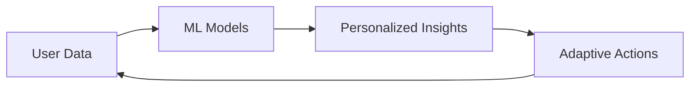

# 📱 KOGNISIA - Phase 4 Development Plan
## Mobile Optimization & Advanced Features

---

## 🎯 **PHASE 4 OBJECTIVES**

### **Primary Goals**
1. **Mobile Experience Enhancement** - Optimize dashboard for mobile devices
2. **Advanced AI Integration** - Implement sophisticated ML models
3. **Social Learning Expansion** - Enhanced collaboration features
4. **Enterprise Analytics** - Advanced institutional reporting

---

## 📱 **MOBILE OPTIMIZATION**

### **Responsive Dashboard Improvements**
- **Mobile-First Layout** - Redesign dashboard for screens < 768px
- **Touch-Friendly Interactions** - Optimize charts and controls for touch
- **Performance Optimization** - Reduce bundle size for mobile networks
- **Offline Capabilities** - Cache critical data for offline access

### **Technical Implementation**
```typescript
// Mobile Optimization Strategy
interface MobileOptimization {
  responsive: {
    breakpoints: { mobile: '768px', tablet: '1024px' }
    layout: 'mobile-first'
    components: 'touch-optimized'
  }
  performance: {
    bundleSize: '< 2MB mobile'
    loadTime: '< 3s on 3G'
    offline: 'critical-data-cache'
  }
}
```

---

## 🧠 **ADVANCED AI FEATURES**

### **Enhanced ML Models**
- **Deep Learning Predictions** - Neural networks for performance forecasting
- **Personalized Learning Paths** - AI-generated curriculum recommendations
- **Adaptive Difficulty** - Real-time adjustment based on performance
- **Behavioral Analytics** - Learning pattern recognition

### **Implementation Architecture**


---

## 👥 **SOCIAL LEARNING FEATURES**

### **Collaboration Tools**
- **Study Groups** - Team formation and management
- **Peer Review System** - Student-to-student feedback
- **Knowledge Sharing** - Community Q&A and resources
- **Group Challenges** - Team-based competitions

### **Social Gamification**
- **Team Leaderboards** - Group achievement tracking
- **Collaborative Quests** - Multi-user challenges
- **Mentorship Program** - Senior student guidance system
- **Social Recognition** - Peer appreciation features

---

## 📊 **ENTERPRISE ANALYTICS**

### **Institutional Dashboard**
- **School-Wide Metrics** - Aggregate performance data
- **Teacher Analytics** - Class-level insights
- **Risk Profiling** - At-risk student identification
- **Resource Optimization** - Classroom utilization analysis

### **Advanced Reporting**
- **Custom Report Builder** - Drag-and-drop institutional reports
- **Compliance Tracking** - Educational standards alignment
- **Export Capabilities** - Multiple format data export
- **API Integration** - LMS and SIS connectivity

---

## 🛠️ **TECHNICAL ENHANCEMENTS**

### **Performance Optimization**
- **Advanced Caching** - Redis implementation for frequently accessed data
- **Lazy Loading** - Component-level code splitting
- **Image Optimization** - WebP format with responsive images
- **CDN Optimization** - Global content delivery

### **Security & Reliability**
- **Enhanced Authentication** - Multi-factor authentication
- **Data Protection** - Advanced encryption and privacy controls
- **Rate Limiting** - API abuse prevention
- **Monitoring & Alerting** - Proactive issue detection

---

## 📅 **IMPLEMENTATION TIMELINE**

### **Sprint 1 (Weeks 1-2): Mobile Optimization**
- Responsive dashboard redesign
- Touch interaction optimization
- Mobile performance testing

### **Sprint 2 (Weeks 3-4): AI Enhancement**
- ML model integration
- Personalized recommendations
- Adaptive difficulty system

### **Sprint 3 (Weeks 5-6): Social Features**
- Study group functionality
- Peer review system
- Team challenges

### **Sprint 4 (Weeks 7-8): Enterprise Analytics**
- Institutional dashboard
- Advanced reporting tools
- API integrations

---

## 🎯 **SUCCESS METRICS**

### **Mobile Metrics**
- **Mobile Engagement** +40% improvement
- **Load Time** < 3 seconds on 3G
- **Offline Usage** 60% of critical functions available

### **AI Performance**
- **Prediction Accuracy** > 90%
- **Personalization Score** > 85%
- **Adaptive Response Time** < 200ms

### **Social Impact**
- **Collaboration Rate** +50% increase
- **Peer Engagement** +60% improvement
- **Knowledge Sharing** 3x content contribution

---

## 🚀 **DELIVERY PLAN**

### **Development Approach**
- **Agile Sprints** - 2-week iterations
- **Continuous Integration** - Automated testing and deployment
- **User Feedback** - Regular testing with target users
- **Performance Monitoring** - Real-time system health tracking

### **Quality Assurance**
- **Mobile Testing** - Device and browser compatibility
- **AI Validation** - Model accuracy and bias testing
- **Security Auditing** - Regular penetration testing
- **Performance Benchmarking** - Load and stress testing

---

*This plan builds upon Phase 3's solid foundation to create a comprehensive, mobile-first, AI-enhanced, socially-connected learning platform*